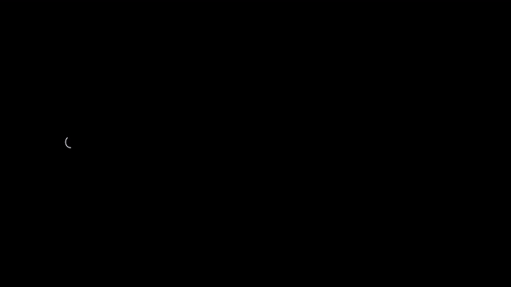
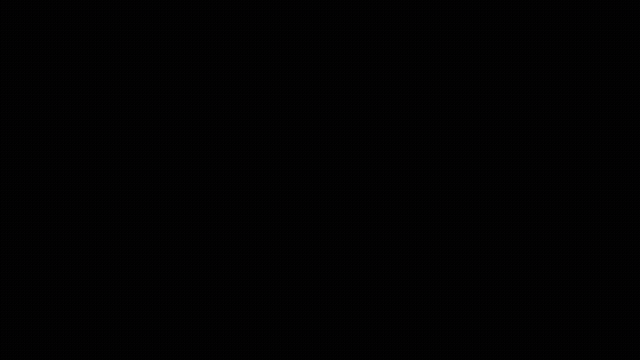

<h1 align="center">QuADMESH</h1>

<p align="center">
  <strong>Quadrilateral mesh generation — Python port of the QuADMESH MATLAB toolchain (port in progress, est. Aug 2026).</strong>
</p>

<p align="center">
  <strong><a href="https://scholar.google.com/citations?user=IBFSkOcAAAAJ&hl=en">Dominik Mattioli</a><sup>1†</sup>, <a href="https://scholar.google.com/citations?user=mYPzjIwAAAAJ&hl=en">Ethan Kubatko</a><sup>2</sup></strong><br>
  <sup>†</sup>Corresponding author | <sup>1</sup>Unaffiliated | <sup>2</sup>Ohio State University (CHIL)
</p>

<p align="center">
  <a href="https://pypi.org/project/admesh2D/"></a>
  <a href="https://www.python.org/downloads/"></a>
  <a href="https://github.com/domattioli/QuADMESH/actions/workflows/tests.yml"></a>
  <a href="https://doi.org/10.5281/zenodo.20350483"></a>
  <a href="https://github.com/domattioli/QuADMESH/issues"></a>
  <a href="LICENSE"></a>
</p>

> **Attention MATLAB users:** This Python library is the actively-developed successor to the original MATLAB codebase. That original code (no longer maintained) is frozen under [`matlab/quadmesh`](https://github.com/domattioli/QuADMESH/tree/main/matlab/quadmesh). Version 1.0.0 will come with a MATLAB wrapper of the modernized code (Est. Aug 2026).

---

End-to-end QuADMESH+ run on a smaller annulus (131 tris / 79 verts / 3 layers), showing algorithmic stages: triangulated input → layer decomposition → `tri2quad_routine` → `post_process_routine` (doublet collapse, quad-vertex merge, angle + FEM smoothing). The faithful path is **quad-pure** — zero residual triangles in the output.



---

## Why QuADMesh

Quadrilateral elements outperform triangles in structured flow simulations — lower interpolation error, better alignment with flow features. QuADMesh brings the OSU CHIL Lab's thesis-proven tri2quad algorithm to Python:

- **Skeletonization-driven** — layer decomposition via medial axis gives quad-pure output (zero residual triangles) on the reference domains.
- **Algorithm-faithful** — 1:1 port of `Tri2QuadRoutine.m` and `PostProcessRoutine.m` from the 2017 MATLAB thesis code.
- **Ecosystem-integrated** — pairs with CHILmesh (data structure, smoothing) and serves as the primary baseline in MADMESHing benchmarks.

## Install

```bash
pip install -e .            # from the repo root (src-layout)
pip install -e ".[dev]"     # + pytest for the test suite
pip install -e ".[plot]"    # + matplotlib for quality plots
```

## Quickstart

```bash
pip install -e .
python -m quadmesh.cli in.14 -o out.14   # convert fort.14
pytest -q                                  # 79 tests
```

Reproduce the annulus pipeline animation (requires manim + ffmpeg + cairo/pango):

```bash
pip install -e . manim
manim -qm videos/scripts/tri2quad_pipeline_annulus.py AnnulusPipelineScene
```

No-manim fallback (matplotlib only, GIF): `python videos/scripts/render_pipeline_gif.py`

## Algorithm

### Tri2Quad algorithm

Step-by-step illustration of the Tri2Quad layer routine on a 6×6 vertex grid (50 triangles, three layers). Processes innermost layer first per MATLAB's `for iLayer = Domain.nLayers:-1:1` loop in `matlab/quadmesh/02_Tri2Quad_Routine/Tri2QuadRoutine.m`: walk CCW boundary path, flag every-other interior edge via element-flagging, merge each triangle pair into a quad.



Higher-fidelity mp4: [`videos/tri2quad_6x6_grid.mp4`](videos/tri2quad_6x6_grid.mp4). Generator: [`videos/scripts/tri2quad_6x6_grid.py`](videos/scripts/tri2quad_6x6_grid.py).

### Repository layout

```
src/quadmesh/   Python package (the maintained implementation)
tests/          pytest suite; tests/fixtures/meshes/ holds .14 test meshes
docs/           MAPPING.md (MATLAB→Python), session notes
matlab/         frozen legacy MATLAB reference (not installable)
```

`chilmesh` is an external dependency (`chilmesh>=0.4.0`), not vendored.

## Ecosystem

| Repo | Role |
|---|---|
| [CHILmesh](https://github.com/domattioli/CHILmesh) | Core engine — QuADMesh uses CHILmesh for adjacency and smoothing; CHILmesh's data structure descends from the original QuADMesh+ |
| [ADMESH](https://github.com/domattioli/ADMESH) | Triangle mesh generator; QuADMesh converts ADMESH triangulations to quads |
| [ADMESH-Domains](https://github.com/domattioli/ADMESH-Domains) | Registry of ADCIRC domains; feeds test meshes to the QuADMesh pipeline |
| [MADMESHing](https://github.com/domattioli/MADMESHing) | Benchmark harness comparing QuADMesh+ (tri2quad) against other quad generators |

**MATLAB reference**: [`matlab/quadmesh`](matlab/quadmesh) — frozen legacy code; the Python port aims for full parity by Aug 2026. See also: [Mattioli 2017 thesis](http://rave.ohiolink.edu/etdc/view?acc_num=osu1500627779532088).

*[DomI](https://github.com/domattioli/DomI) provides dev-session skills and governance for all repos.*

## Status & Roadmap

- **Shipped**: Tri2Quad routine (1:1 MATLAB port) · PostProcess routine (doublet collapse, smoothing) · annulus pipeline demo · 79-test suite
- **In flight**: Full Python port of remaining MATLAB stages (est. Aug 2026) · C++ or Rust performance evaluation · ADMESH library integration
- **Python port — tracking** (est. June 2026): Porting from `matlab/quadmesh`; currently implemented: Tri2Quad + PostProcess pipelines. Remaining stages tracked in open issues.

Open issues: [github.com/domattioli/QuADMesh/issues](https://github.com/domattioli/QuADMesh/issues)

## Documentation

- [`docs/MAPPING.md`](docs/MAPPING.md) — MATLAB → Python function mapping
- [`videos/`](videos/) — demo animations and generator scripts
- [`matlab/`](matlab/) — frozen MATLAB reference implementation
- [`specs/`](specs/) — speckit specs and plans

## Citation

**Algorithm / theory** (cite the original paper):

> Mattioli, DO (2017). QuADMESH+: A Quadrangular ADvanced Mesh Generator for Hydrodynamic Models. The Ohio State University, OhioLINK - Electronic Theses and Dissertations Center. Master's Thesis. <[http://rave.ohiolink.edu/etdc/view?acc_num=osu1500627779532088](http://rave.ohiolink.edu/etdc/view?acc_num=osu1500627779532088)>

**This software** (cite the archived release):

> Mattioli, DO, Kubatko, EJ (2026). QuADMESH: A Quadrangular ADvanced, automatic unstructured MESH generator for 2D hydrodynamic domains. Zenodo. <[https://doi.org/10.5281/zenodo.20264101](https://doi.org/10.5281/zenodo.20350484)>

The DOI `10.5281/zenodo.20264101` resolves to the latest release; version-specific DOIs are listed on the [Zenodo record](https://doi.org/10.5281/zenodo.20350484). A [`CITATION.cff`](CITATION.cff) [will be] provided at the repo root for tools that consume it (GitHub's "Cite this repository" button, Zotero, etc.)

## Contributing

Contributions and bug reports are welcome — open an issue or pull request on [GitHub](https://github.com/domattioli/QuADMesh/issues).

**Dominik Mattioli** — [repo owner](https://github.com/domattioli/QuADMesh) | **Ethan J. Kubatko** — kubatko.3@osu.edu

## License

Apache 2.0 — see [`LICENSE`](LICENSE).
