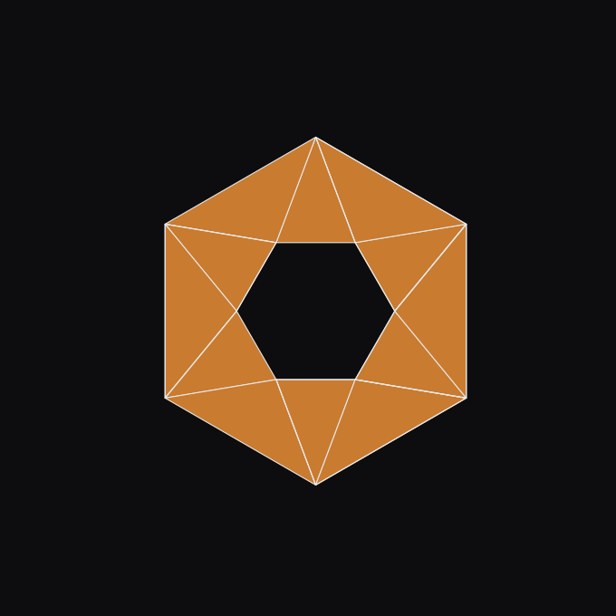

<p align="center">
  
</p>

<p align="center">
  <sub>Regenerate: <code>python videos/scripts/render_logo_gif.py</code> (matplotlib only, no ffmpeg).</sub>
</p>

<h1 align="center">QuADMESH</h1>

<p align="center">
  <strong>A Quadrangular ADvanced, automatic unstructured MESH generator for 2D shallow-water models.</strong><br>
  Python port of the MATLAB QuADMESH library and a Pythonic API.
</p>

<p align="center">
  <strong><a href="https://scholar.google.com/citations?user=IBFSkOcAAAAJ&hl=en">Dominik Mattioli</a><sup>1†</sup>, <a href="https://scholar.google.com/citations?user=mYPzjIwAAAAJ&hl=en">Ethan Kubatko</a><sup>2</sup></strong><br>
  <sup>†</sup>Corresponding author | <sup>1</sup>Unaffiliated | <sup>2</sup>Ohio State University (CHIL)
</p>

<p align="center">
  <a href="https://pypi.org/project/admesh2D/"></a>
  <a href="https://www.python.org/downloads/"></a>
  <a href="https://github.com/domattioli/QuADMESH/actions/workflows/tests.yml"></a>
  <a href="https://doi.org/10.5281/zenodo.20351165"></a>
  <a href="https://github.com/domattioli/QuADMESH/issues"></a>
  <a href="LICENSE"></a>
</p>

> **Attention MATLAB users:** This Python library is the actively-developed successor to the original MATLAB codebase. That original code (no longer maintained) is frozen under [`src/matlab/quadmesh`](https://github.com/domattioli/QuADMESH/tree/main/src/matlab/quadmesh). Version 1.0.0 will come with a MATLAB wrapper of the modernized code (Est. Aug 2026).

---

## Table of Contents

- [Why QuADMESH](#why-quadmesh)           -- coming soon...
- [Install](#install)                     -- coming soon...
- [Quickstart](#quickstart)               -- coming soon...
- [Status &amp; roadmap](#status--roadmap) -- coming soon...
- [Documentation](#documentation)          -- coming soon...
- [Citation](#citation)
- [Related projects](#Related-projects)
- [Contact](#contact)
- [License](#license)

---

## Install

```bash
pip install -e .            # from the repo root (src-layout)
pip install -e ".[dev]"     # + pytest for the test suite
pip install -e ".[plot]"    # + matplotlib for quality plots
```

```bash
pytest -q                          # 79 tests
python -m quadmesh.cli in.14 -o out.14
```

## Repository layout

```
src/quadmesh/   Python package (the maintained implementation)
tests/          pytest suite; tests/fixtures/meshes/ holds .14 test meshes
docs/           MAPPING.md (MATLAB→Python), session notes
specs/          speckit specs/plans/tasks
videos/         demo assets used in this README
src/matlab/     frozen legacy MATLAB reference (not installable)
archive/        in-repo holding pen for future removal (upstream dups, .mat binaries)
```

`chilmesh` functionality is **not vendored** — it is an external dependency
(`chilmesh>=0.4.0`). The old MATLAB `@CHILmesh` class lives under `archive/` only
for historical reference; see [CHILmesh](https://github.com/domattioli/CHILmesh).

## Python port of MATLAB Functionality -- Coming very soon (est. June 2026)

## Status & roadmap
As of May 2026 we are so back.
  - Currently porting the original code to Python
  - Next will optimize python, evaluate if C++ or Rust makes sense.
  - Finally going to implement it formally within a unifed ADMESH Library.

## Citation

**Algorithm / theory** (cite the original paper):

> Mattioli, DO (2017). QuADMESH+: A Quadrangular ADvanced Mesh Generator for Hydrodynamic Models. The Ohio State University, OhioLINK - Electronic Theses and Dissertations Center. Master's Thesis. <[http://rave.ohiolink.edu/etdc/view?acc_num=osu1500627779532088](ttp://rave.ohiolink.edu/etdc/view?acc_num=osu1500627779532088)>

**This software** (cite the archived release):

> Mattioli, DO, Kubatko, EJ (2026). QuADMESH: A Quadrangular ADvanced, automatic unstructured MESH generator for 2D hydrodynamic domains. Zenodo. <[https://doi.org/10.5281/zenodo.20351165](https://doi.org/10.5281/zenodo.20351165)>

The DOI `10.5281/zenodo.20351165` resolves to the latest release; version-specific DOIs are listed on the [Zenodo record](https://doi.org/10.5281/zenodo.20351165). A [`CITATION.cff`](CITATION.cff) [will be] provided at the repo root for tools that consume it (GitHub's "Cite this repository" button, Zotero, etc.)

## Related projects

- **[ADMESH](https://github.com/domattioli/ADMESH)** — C++ implementation with pythonic wrapper and API..
- **[CHILmesh](https://github.com/domattioli/CHILmesh)** — federated registry of ADCIRC-compatible meshes for discovery, lineage tracking, and community contribution. Built as a companion to this library.

## Contact

#### Dominik Mattioli - ([repo owner](https://github.com/domattioli/QuADMESH))
#### Ethan J Kubatko  — [kubatko.3@osu.edu](mailto:kubatko.3@osu.edu)

## License

**Noncommercial / research use only.** Licensed under the PolyForm Noncommercial License 1.0.0 **with an additional No-AI/ML-training restriction** — see [LICENSE](LICENSE) and [AI-USAGE.md](AI-USAGE.md). No commercial use and no use as AI/ML training data without a separate written license. Commercial or AI-training licenses: contact domattioli via mango-kooky-okay@duck.com

